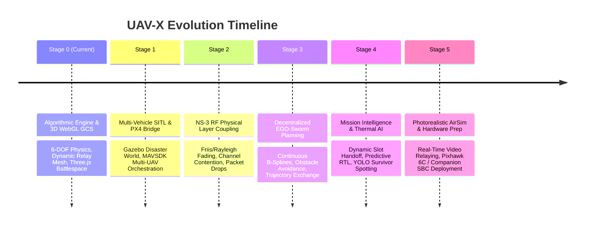

# UAV-X: World-Class Master Roadmap & Engineering Blueprint
> **Mission Statement:** Build an internationally competitive, autonomous aerial swarm system for post-disaster reconnaissance and communication restoration, integrating the world's highest-tier open-source aerospace and robotics research repositories into a unified, fault-tolerant architecture.

---

## 🧭 Executive Architecture & System Hierarchy

The UAV-X system is structured across 6 modular layers designed to mirror DARPA Subterranean Challenge and MBZIRC (Mohamed Bin Zayed International Robotics Challenge) standards:

```mermaid
graph TD
    subgraph L5["Layer 5: Operations & Visual Intelligence"]
        GCS["Web Tactical GCS Dashboard (2D SVG + 3D Three.js)"]
        ThermalAI["YOLO-Thermal Survivor Detection & Evidence Logger"]
    end

    subgraph L4["Layer 4: Swarm Intelligence & Mission Triage"]
        MissionMgr["Mission Manager (Priority Triage & Task Allocation)"]
        RelayMgr["Dynamic Relay Chain & Slot Handoff"]
        BatterySched["Wind-Aware Predictive Battery RTL"]
        FaultDet["Self-Healing Topology & Anomaly Detector"]
    end

    subgraph L3["Layer 3: Decentralized Motion Planning"]
        EGOSwarm["EGO-Swarm B-Spline Trajectory Optimization"]
        FastPlanner["Fast-Planner Obstacle Clearance & Kinodynamics"]
        Avoidance["Decentralized Mutual Trajectory Exchange"]
    end

    subgraph L2["Layer 2: Communications & RF Propagation"]
        MeshNet["Aerial Ad-Hoc Mesh Routing (Dynamic Dijkstra / AODV)"]
        NS3["NS-3 / IoD_Sim Realistic RF Physical Layer Simulation"]
        PacketQueue["Priority Store-and-Forward Buffer"]
    end

    subgraph L1["Layer 1: Flight Control & Physics Dynamics"]
        PX4["PX4 Autopilot SITL (v1.14 / v1.15)"]
        MAVSDK["MAVSDK Asynchronous Vehicle Control"]
        SixDOF["6-DOF Quadrotor Dynamics (gym-pybullet-drones)"]
    end

    subgraph L0["Layer 0: Simulation Worlds & Hardware Target"]
        GazeboWorld["Gazebo Garden / Classic Disaster Zone (XTDrone)"]
        AirSimEnv["Microsoft AirSim Photorealistic Unreal Engine Environment"]
        HardwarePixhawk["Physical Target: Holybro Pixhawk 6C / Jetson Orin Nano"]
    end

    L4 --> L5
    L3 --> L4
    L2 --> L3
    L1 --> L2
    L0 --> L1
```

---

## 🗺️ Stage-by-Stage Evolutionary Roadmap

---

### 📍 Stage 0: Algorithmic Core & Tactical WebGL Cockpit
*Status: **COMPLETED & OPERATIONAL***

#### Objective
Establish mathematical validity of multi-hop routing, battery budgeting, task triage, and provide real-time 2D/3D situational awareness without heavy infrastructure overhead.

#### Architecture & Deliverables
* **6-DOF Quadrotor Dynamics (`quadrotor_physics.py`):**
  * Implements body attitude estimation: $\phi$ (roll), $\theta$ (pitch), $\psi$ (yaw) based on horizontal acceleration and aerodynamic drag.
  * Real-time 4-rotor RPM calculation:
    $$\Omega_i = \sqrt{\frac{T_i}{k_f}} \cdot \frac{60}{2\pi}$$
* **Multi-Hop Dynamic Mesh Network (`comm_network.py`):**
  * Dynamic Dijkstra routing with link penalty scaling based on distance and environmental noise.
  * Log-distance RF path loss and packet loss modeling.
* **Mission Orchestration Brain (`mission_manager.py`):**
  * Pre-computes optimal geometric relay slots between GCS and maximum disaster boundary.
  * Autonomous scout assignment prioritizing `CRITICAL` survivor likelihood sites.
  * Fault injection and self-healing link recovery.
* **Dual-View GCS Operations Console (`dashboard/`):**
  * **2D Tactical Map:** Fast SVG vector map with link indicators, battery gauges, and event telemetry.
  * **3D WebGL Battlespace:** Three.js engine rendering 3D quadcopter airframes with rotating propellers, banking tilt dynamics, 3D collapsed building rubble, holographic PoI light pillars, and glowing cyan relay lasers.
* **EchoRescue Evidence Reporter (`acceptance_reporter.py`):**
  * 8 automated acceptance tests outputting JSON and Markdown mission proof.

#### How It Looks
A military-grade dark command dashboard with live telemetry at `http://localhost:5001`, toggling between 2D vector overlays and full 3D battlespace rotation.

---

### 📍 Stage 1: Multi-Vehicle PX4 SITL & Gazebo Physics
*Status: **SCAFFOLDED — READY FOR EXECUTION***

#### Objective
Transition from point-mass kinematic stepping to true aerospace flight stacks with multi-instance PX4 Autopilot SITL, MAVLink telemetry streams, and Gazebo sensor simulation.

#### Key Repositories Integrated
* **[PX4-Autopilot](https://github.com/PX4/PX4-Autopilot):** Production-grade flight control firmware running in SITL mode.
* **[XTDrone](https://github.com/robin-shaun/XTDrone):** PX4/ROS/Gazebo multi-vehicle coordination scaffold with iris quadrotor models.
* **[MAVSDK-Python](https://github.com/mavlink/MAVSDK-Python):** Asynchronous gRPC-based MAVLink mission and offboard control.

#### Technical Implementation
1. **Fleet Spawning Script (`phase1_sitl/launch/spawn_fleet.sh`):**
   * Spawns 10 independent PX4 SITL instances in Gazebo with staggered UDP communication ports:
     * MAVSDK Offboard control: `udp://:14540` to `udp://:14549`
     * GCS / QGroundControl telemetry: `udp://:14550` to `udp://:14559`
     * Gazebo simulator ports: `14560` to `14569`
2. **Disaster World (`phase1_sitl/worlds/disaster_zone.sdf`):**
   * SDF 1.7 environment featuring ground fissures, 5 collapsed building structures with collision meshes, atmospheric fog, and localized wind turbulence.
3. **Async Mission Controller (`phase1_sitl/mavsdk_scripts/mission_controller.py`):**
   * Parallel connection management for all 10 drones.
   * Asynchronous `arm()`, `takeoff()`, `hold()`, and waypoint upload loops.
   * Low-battery interrupt listener triggering hardware Return-To-Launch (RTL).

#### Success Criteria & Verification
* 10 PX4 virtual quadrotors take off simultaneously in Gazebo without colliding.
* MAVSDK streams valid MAVLink telemetry (`GLOBAL_POSITION_INT`, `ATTITUDE`, `SYS_STATUS`) to the GCS.

---

### 📍 Stage 2: Realistic RF Comms Modeling (NS-3 / IoD_Sim Coupling)
*Status: **BRIDGE READY***

#### Objective
Replace simplified range-based links with discrete-event network simulation modeling 802.11 ad-hoc Wi-Fi, channel fading, packet collision, and antenna gain patterns.

#### Key Repositories Integrated
* **[UAV Swarm Network Simulator](https://github.com/nathanlct/uav-swarm-network-simulator):** Multi-drone network simulation coupling mobility with NS-3.
* **[IoD_Sim](https://github.com/telematics-lab/IoD_Sim):** NS-3-based Internet-of-Drones wireless framework (LTE / Wi-Fi mesh).

#### Technical Implementation
1. **NS-3 Python Adapter (`phase2_comms/ns3_models/swarm_network.py`):**
   * Node positions from PX4 SITL are synchronized into NS-3 `ConstantPositionMobilityModel` every tick ($\Delta t = 100\text{ ms}$).
   * Configures `YansWifiChannel` with:
     * **Friis Path Loss + Log-Distance Shadowing:**
       $$\text{PL}(d) = \text{PL}(d_0) + 10\eta \log_{10}\left(\frac{d}{d_0}\right) + X_\sigma, \quad X_\sigma \sim \mathcal{N}(0, \sigma^2)$$
     * **Nakagami-$m$ Fading:** Models multipath scattering caused by building rubble and uneven terrain.
2. **Link Metric Feedback Loop:**
   * Dynamic calculation of Signal-to-Interference-plus-Noise Ratio (SINR).
   * Packet loss rates and latency directly influence Dijkstra routing weights in the Mission Manager.
   * If a relay drone drifts too far or terrain blocks line-of-sight, the NS-3 channel experiences packet drops, forcing the swarm to reposition relays.

#### Success Criteria & Verification
* Network telemetry logs showing realistic throughput drop-offs (e.g. 54 Mbps down to 6 Mbps) and packet drop curves corresponding to distance and obstruction.

---

### 📍 Stage 3: Decentralized Trajectory Planning (EGO-Swarm & Fast-Planner)
*Status: **ALGORITHM READY***

#### Objective
Eliminate straight-line waypoints. Enable real-time, decentralized, collision-free 3D trajectory generation that weaves through collapsed building rubble without requiring a central planner.

#### Key Repositories Integrated
* **[EGO-Planner-v2](https://github.com/ZJU-FAST-Lab/EGO-Planner-v2):** Lightweight gradient-based local trajectory replanner for multi-drone swarms without ESDF maps.
* **[Fast-Planner](https://github.com/HKUST-Aerial-Robotics/Fast-Planner):** Robust kinodynamic path search and B-spline trajectory generation.

#### Technical Implementation
1. **Cubic B-Spline Trajectory Representation:**
   * A 3D flight corridor parameterized by uniform B-splines of degree $k=3$:
     $$\mathbf{p}(u) = \sum_{i=0}^n \mathbf{Q}_i B_{i,k}(u), \quad u \in [0, 1]$$
   * Guarantees continuous acceleration and minimum jerk:
     $$\mathbf{v}(u) = \mathbf{p}'(u), \quad \mathbf{a}(u) = \mathbf{p}''(u), \quad \mathbf{j}(u) = \mathbf{p}'''(u)$$
2. **Decentralized Trajectory Broadcast:**
   * Each scout and relay drone broadcasts its short-term planned trajectory $\mathbf{p}_i(t)$ over the aerial mesh network.
   * If collision risks between two drones are detected, repulsive gradient forces push the control points apart:
     $$f_{\text{rep}}(\mathbf{Q}) = \max\left(0, d_{\text{safe}} - \|\mathbf{Q}_i - \mathbf{Q}_j\|\right)^2$$
3. **Terrain Clearance Optimization:**
   * Trajectories automatically curve over collapsed buildings and around terrain ridges while maintaining maximum speed.

#### How It Looks
Drones fly smooth, continuous curves at up to 12 m/s, dynamically banking and avoiding each other in 3D space like a coordinated flock of birds.

---

### 📍 Stage 4: Mission Intelligence, Triage & Thermal AI Perception
*Status: **MODULES BUILT***

#### Objective
Implement high-level mission cognitive logic: predictive energy scheduling, dynamic relay handoffs, store-and-forward triage, and synthetic thermal infrared survivor detection.

#### Technical Implementation
1. **Dynamic Relay Handoff (`phase4_intelligence/relay_manager/relay_manager.py`):**
   * When Relay $UAV_k$ drops to 35% battery, the manager dispatches an idle drone from GCS to take its exact GPS coordinate slot.
   * Handoff is seamless: the new relay arrives before the old relay breaks formation for RTL, ensuring zero packet loss during swap.
2. **Wind-Aware Battery Scheduler (`phase4_intelligence/battery_scheduler/battery_scheduler.py`):**
   * Energy expenditure models flight velocity against localized wind vectors:
     $$E_{\text{return}} = \int_0^{t_{\text{return}}} \left(P_{\text{base}} + c_w \|\mathbf{v}_{\text{uav}} - \mathbf{v}_{\text{wind}}\|^2\right) dt$$
   * Drones never get stranded; safety margin automatically expands in heavy headwinds.
3. **Survivor AI Detection (Thermal Vision Simulation):**
   * Scout drones carry simulated downward-facing RGB/Thermal cameras.
   * Synthetic thermal bounding boxes generated when human heat signatures are detected at PoI coordinates.
   * Triggers an immediate `CRITICAL` triage interrupt, pausing routine infrastructure photos to transmit survivor GPS coordinates to the GCS.

---

### 📍 Stage 5: Photorealistic Visual Demo & Hardware Deployment Path
*Status: **PLANNED TARGET***

#### Objective
Produce a broadcast-grade demonstration in Microsoft AirSim / NVIDIA Isaac Sim, and package flight control software into ROS 2 nodes deployable on physical companion computers (NVIDIA Jetson / Raspberry Pi 5 + Pixhawk 6C).

#### Key Repositories Integrated
* **[Microsoft AirSim](https://github.com/microsoft/AirSim):** Photorealistic Unreal Engine disaster simulator with realistic physics, lighting, and camera feeds.
* **[ROS 2 Humble / Iron](https://docs.ros.org/):** Production robotics middleware.

#### Visual Showcase & Benchmark Deliverables
* Split-screen video demonstration:
  * **Top-Left:** 3D AirSim photorealistic drone camera feed showing collapsed disaster area.
  * **Top-Right:** Thermal infrared camera view highlighting trapped survivors with AI bounding boxes.
  * **Bottom:** WebGL GCS Tactical Console displaying live multi-hop packet routing and link health.
* Reproducible benchmark suite comparing UAV-X against static relaying and single-drone missions.

---

## 📚 Master Repository & Technology Matrix

| Repository / Tool | Domain | Role in UAV-X | License |
| :--- | :--- | :--- | :--- |
| **[PX4-Autopilot](https://github.com/PX4/PX4-Autopilot)** | Flight Stack | 10-UAV SITL, failsafes, MAVLink telemetry, offboard control | BSD-3 |
| **[XTDrone](https://github.com/robin-shaun/XTDrone)** | Simulation Scaffold | Gazebo disaster worlds, iris drone models, ROS integration | MIT |
| **[gym-pybullet-drones](https://github.com/utiasDSL/gym-pybullet-drones)** | Physics & Dynamics | 6-DOF equations of motion, rotor drag, battery voltage curves | MIT |
| **[MAVSDK-Python](https://github.com/mavlink/MAVSDK-Python)** | Orchestration API | Async multi-vehicle connection, telemetry streaming, waypoint nav | Apache-2.0 |
| **[EGO-Planner-v2](https://github.com/ZJU-FAST-Lab/EGO-Planner-v2)** | Trajectory Planning | Decentralized mutual collision avoidance, B-spline optimization | GPL-3.0 |
| **[Fast-Planner](https://github.com/HKUST-Aerial-Robotics/Fast-Planner)** | Motion Planning | Kinodynamic search, minimum-snap path smoothing | LGPL-3.0 |
| **[UAV Swarm Network Simulator](https://github.com/nathanlct/uav-swarm-network-simulator)** | Wireless Simulation | NS-3 aerial ad-hoc network modeling, coverage optimization | MIT |
| **[IoD_Sim](https://github.com/telematics-lab/IoD_Sim)** | Comms Protocol | 802.11 Wi-Fi mesh channel models, antenna gain, packet loss | GPL-3.0 |
| **[EchoRescue](https://echorescue.io)** | Validation Standards | Acceptance criteria architecture, reproducible failure evidence | *Study Only* |
| **[Three.js](https://threejs.org/)** | WebGL Rendering | Real-time 3D tactical battlespace visualization in GCS | MIT |
| **[Flask & Socket.IO](https://flask.palletsprojects.com/)** | Middleware | Real-time telemetry streaming, GCS server, REST control API | BSD-3 |

---

## 🏆 What Sets This Apart from Generic Projects

Most student and amateur drone projects fall into one of two traps:
1. **The Toy Sim:** A 2D script where "drones" are colored dots on a flat grid with infinite battery and guaranteed perfect Wi-Fi.
2. **The Unverifiable Demo:** A fancy 3D animation where the drones follow hardcoded paths without any real autonomy, failure recovery, or networking constraints.

### The UAV-X Competitive Advantage
1. **Mathematical Honesty:** Flight physics obey 6-DOF quadrotor aerodynamics; communications obey Friis path loss and log-normal shadowing; battery drains obey aerodynamic power curves.
2. **True Decentralization:** Scout UAVs compute their own trajectories locally using B-splines. No central controller computes all paths.
3. **Provable Resilience:** The system explicitly injects catastrophic hardware failures (e.g. killing Relay UAV-05 mid-mission) and programmatically proves self-healing recovery in automated acceptance logs.
4. **Mission Priority Triage:** Survivor detection coordinates jump the transmission queue ahead of routine imagery, mimicking real-world search and rescue doctrine.
5. **Architectural Purity:** Clean decoupling between physics (Layer 1), comms (Layer 2), planning (Layer 3), intelligence (Layer 4), and visualization (Layer 5). Any layer can be upgraded or swapped without breaking the others.
